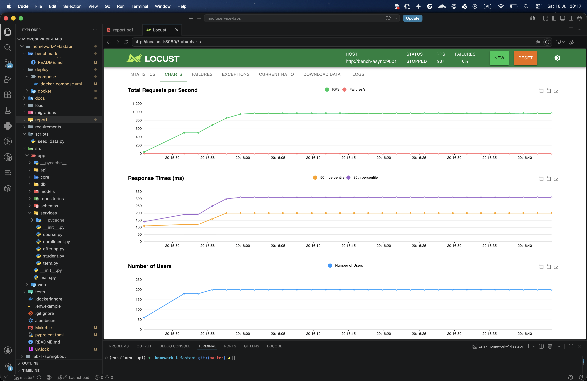
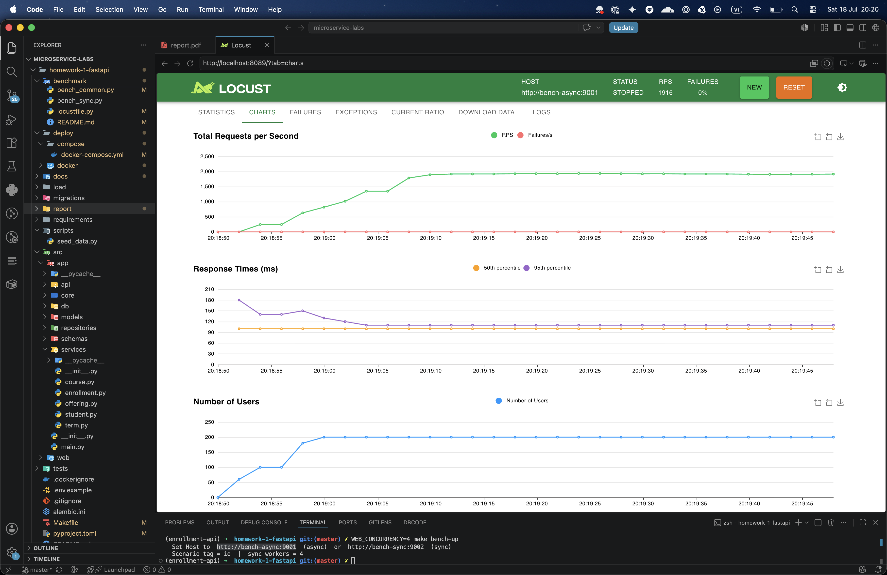

# Bài tập 1

Bài tập 1 so sánh hiệu năng giữa **sync** (Flask, WSGI) và **async** (FastAPI,
ASGI) trên các truy vấn đọc chạm cơ sở dữ liệu, và dùng Locust để chứng minh
tác động của concurrency model tới throughput và latency.

## Thiết kế thí nghiệm

Để cô lập đúng biến "sync so với async", em dựng **hai app tối thiểu song song**
trong thư mục `benchmark/`, expose cùng các endpoint:

- **async**: FastAPI + async SQLAlchemy + asyncpg, chạy bằng uvicorn.
- **sync**: Flask + sync SQLAlchemy + psycopg2, chạy bằng gunicorn.

Cả hai import chung `bench_common.py` (cùng câu lệnh SQL và cùng cách
serialization), nên payload giống hệt nhau. Những thứ được **giữ cố định** để so
sánh công bằng:

- Cùng PostgreSQL, cùng dữ liệu seed, cùng SQL, cùng index; cùng payload JSON.
- **Cùng giới hạn tài nguyên bằng Docker Compose.** Mỗi container app được đặt
  `deploy.resources.limits` với `cpus` và `memory` bằng nhau (`BENCH_CPUS` mặc
  định 2, `BENCH_MEM` mặc định 1g). Nhờ vậy không app nào chiếm nhiều CPU/RAM của
  host hơn app kia, và kết quả không bị nhiễu bởi các tiến trình khác đang chạy
  trên máy. Locust để **không giới hạn** (để bộ tạo tải không trở thành
  bottleneck); Postgres dùng chung nên ảnh hưởng như nhau tới cả hai.
- **Connection pool đặt cao** (`BENCH_POOL_SIZE` mặc định 100, `max_overflow=0`)
  ở cả hai app, để pool không phải là nút thắt cổ chai giả tạo. Mỗi worker là một
  tiến trình có pool riêng, nên tổng kết nối = (số worker × pool); Postgres nâng
  `max_connections` lên 500 để đủ chỗ.
- Cùng máy; warm up trước khi đo; chạy lặp lại vài lần.

Chỉ có **concurrency model** và **số worker** thay đổi.

Ghi chú về ORM: **SQLAlchemy mặc định là sync**, phần async là tùy chọn và cần
async driver (asyncpg). Dùng async SQLAlchemy bên trong Flask cũng không giúp
được, vì Flask (WSGI) vẫn xử lý blocking từng request trên mỗi worker; không có
event loop dùng chung. Vì vậy contender sync đúng nghĩa là Flask + psycopg2, còn
contender async là FastAPI + asyncpg.

## Kịch bản và cách chạy

Hai loại kịch bản (chọn bằng tag của Locust):

- **read**: các endpoint đọc thật (browse/search offering, chi tiết offering,
  transcript của student, danh sách course). Truy vấn nhanh (sub-millisecond).
- **io**: endpoint `/io` chạy `SELECT pg_sleep(...)` với thời gian mặc định
  **100 ms** (chỉnh qua `BENCH_IO_SECONDS` hoặc `?seconds=`). Kịch bản này cố ý
  làm request bị chờ ở DB để cô lập và phóng đại hiệu ứng sync/async.

Ma trận đo gồm **4 cấu hình**: async 1 worker, async 4 worker, sync 1 worker,
sync 4 worker. Số worker của cả hai app đặt bằng biến `WEB_CONCURRENCY` (uvicorn
`--workers` cho async, gunicorn cho sync), nên async và sync được so ở cùng số
worker. Locust dùng `-u 200 -r 20 -t 60s` (200 users, spawn 20/s, chạy 1 phút),
`wait_time = 0` để mỗi user gửi liên tục, đo throughput ở trạng thái bão hòa.

Cách chạy dùng Docker Compose và Locust web UI (chi tiết ở `benchmark/README.md`):

```bash
make up && make seed              # build image (kèm bench deps) + seed Postgres
make bench-up                     # 1 worker: bench-async :9001, bench-sync :9002
WEB_CONCURRENCY=4 make bench-up   # 4 worker cho cả async và sync
```

Mở Locust UI tại <http://localhost:8089>, đặt Host là `http://bench-async:9001`
(async) hoặc `http://bench-sync:9002` (sync), đặt 200 users và spawn rate 20,
chạy 1 phút và quan sát tab Charts. Kịch bản mặc định là `io`; chạy lại với
`BENCH_TAGS=read make bench-up` cho kịch bản read.

## Kết quả

Chụp màn hình tab Charts của Locust UI cho từng cấu hình (cùng users, cùng kịch
bản io) rồi so sánh.






Số tổng hợp (đọc từ Locust, 200 users, kịch bản io sleep 100 ms):

- async, 1 worker: RPS ≈ 967, p50 ≈ 200 ms, p95 ≈ 310 ms, failures = 0%.
- async, 4 worker: RPS ≈ 1916, p50 ≈ 100 ms, p95 ≈ 110 ms, failures = 0%.
- sync, 1 worker: RPS ≈ 9.1, p50 ≈ 22 s, p95 ≈ 23 s, failures = 0%.
- sync, 4 worker: RPS ≈ 36.7, p50 ≈ 5.4 s, p95 ≈ 5.6 s, failures = 0%.

Nhận xét từ số đo (kịch bản io, sleep 100 ms):

- **sync bị chặn theo số worker.** Mỗi worker chỉ xử lý một request tại một thời
  điểm (block ở DB), pool dư cũng không giúp. Throughput ≈ (số worker) / latency:
  đo được sync 1 worker ≈ 9.1 RPS và sync 4 worker ≈ 36.7 RPS (xấp xỉ gấp 4 lần),
  khớp với kỳ vọng ~10 và ~40 RPS. Vì 200 user dồn vào rất ít chỗ phục vụ, latency
  phình to theo Little's law (users ≈ RPS × latency): 200 / 9.1 ≈ 22 s và
  200 / 36.7 ≈ 5.4 s, đúng với p50 đo được.
- **async overlap nhiều request trên một event loop.** Chỉ 1 worker đã đạt ~967 RPS
  vì pool cho phép khoảng 100 truy vấn DB chạy song song (100 / 0.1 = 1000 RPS là
  trần lý thuyết). Với 4 worker (tổng ~400 chỗ trong pool, nhiều hơn 200 user) thì
  không còn phải xếp hàng chờ pool, latency về sát mức sàn 100 ms và throughput
  ≈ 200 / 0.1 ≈ 1916 RPS.
- **Chênh lệch.** Chỉ **một** async worker (~967 RPS) đã nhanh hơn cả **bốn** sync
  worker (~36.7 RPS) khoảng 26 lần; về độ trễ, async 1 worker p50 ~200 ms so với
  sync 1 worker p50 ~22 s. Cả bốn cấu hình đều 0% lỗi nên khác biệt là thuần
  throughput/latency, không phải do request hỏng.

## Phân tích

- **Cơ chế**: một sync worker block trong suốt round-trip tới DB, nên throughput
  ≈ (số worker) / latency; muốn phục vụ N request I/O song song thì cần khoảng N
  worker (tốn bộ nhớ, thêm tiến trình). Một async worker overlap nhiều round-trip
  trên cùng một event loop nên đạt throughput cao hơn hẳn với một tiến trình, cho
  tới khi chạm giới hạn pool hoặc CPU.
- **Vai trò của pool**: pool giới hạn số truy vấn DB chạy song song. Khi pool nhỏ
  (ví dụ 10) thì chính nó là trần throughput của async; vì vậy thí nghiệm đặt pool
  lớn để trần thật sự đến từ concurrency model và CPU, không phải từ pool.
- **Bottleneck**: ở kịch bản io, DB latency chiếm ưu thế nên khác biệt sync/async
  rất rõ. Ở kịch bản read (truy vấn nhanh) thì DB/CPU dễ thành giới hạn nên khoảng
  cách thu hẹp lại; đây là điểm cần trung thực khi kết luận.
- **Lưu ý về GIL**: psycopg2 nhả GIL trong lúc chờ I/O mạng, nên Flask chạy nhiều
  worker/thread cũng có thể xử lý I/O chồng lấn; điểm mạnh thật sự của async là
  làm được điều đó chỉ trong một thread, tốn ít bộ nhớ và context-switch hơn hẳn,
  và mở rộng tới hàng nghìn kết nối đồng thời.
- **Khi nào async không thắng**: với tác vụ CPU-bound, async không giúp gì; và khi
  DB là bottleneck thì cả hai đều bị chặn như nhau.
