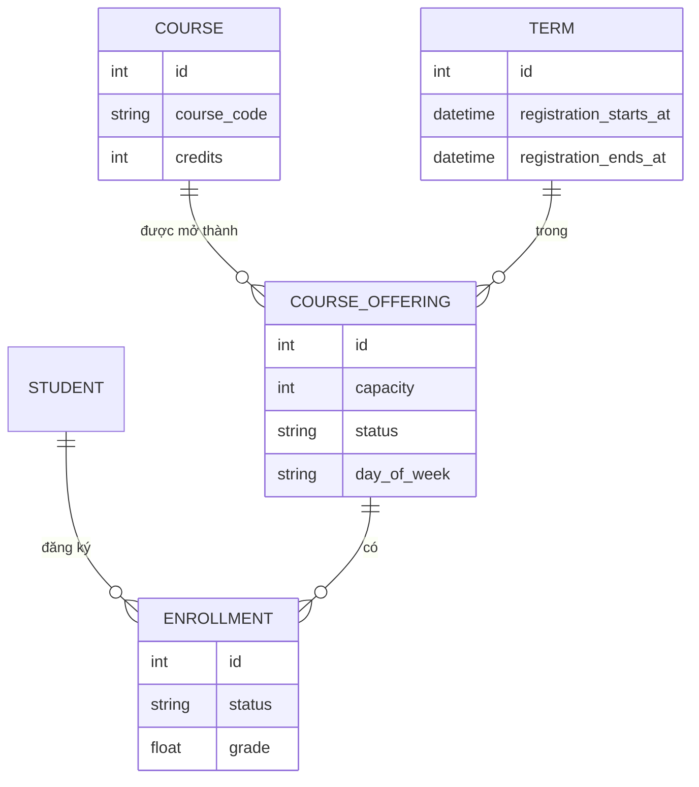
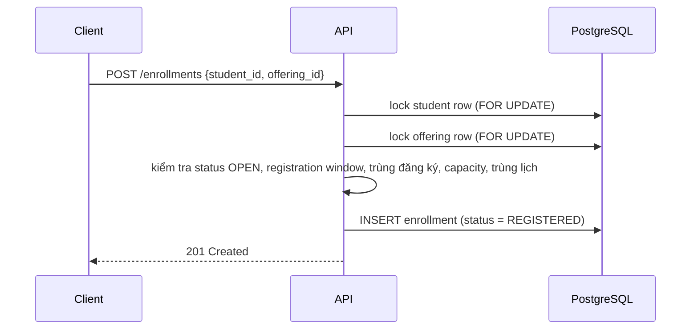
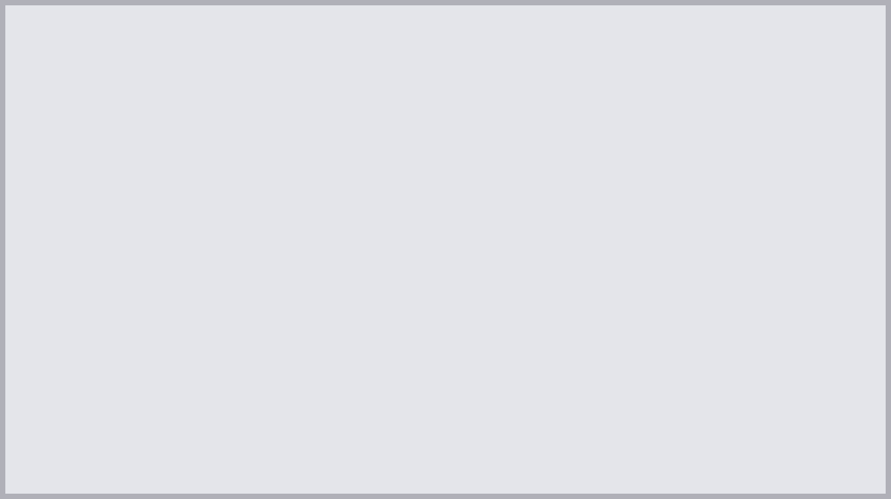
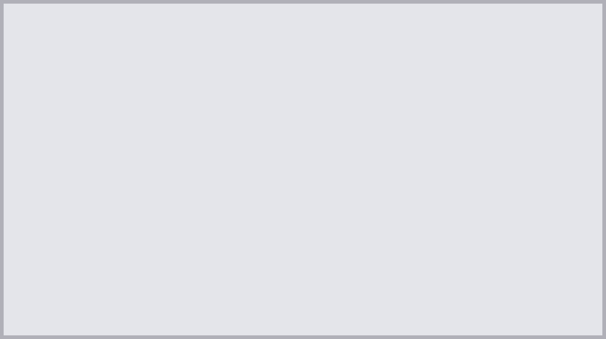

# Bài tập 2 và 3

## Bài tập 2

Bài tập 2 xây dựng Web API đúng chuẩn bằng FastAPI + PostgreSQL cho hệ thống
đăng ký học phần. Kiến trúc phân tầng rõ ràng: `routes` (tầng HTTP) gọi
`services` (business logic, sở hữu transaction), `services` gọi `repositories`
(truy vấn), `repositories` làm việc với `db`. Pydantic schema là ranh giới dữ
liệu giữa các tầng và là contract với client.

### Phạm vi và giả định

- Authentication chưa thuộc phạm vi bài này (để dành cho bài tập sau). API nhận
  `student_id` một cách tường minh thay vì lấy từ session hay token; ở hệ thống
  thật, mọi request `/students/{id}/...` và đăng ký sẽ được authorize theo user
  đang đăng nhập.
- Các thao tác admin (quản lý catalog gồm course, term, offering; thêm hoặc xóa
  student) nằm ngoài phạm vi và chỉ được tạo bằng seed script. API chỉ phục vụ
  các hoạt động của student.

### Domain và cơ sở dữ liệu

Điểm thiết kế cốt lõi: tách phần *catalog* (môn học là gì) khỏi phần *được mở
trong một học kỳ* (khi nào được đăng ký, còn bao nhiêu chỗ, lịch ra sao). Nếu gắn
thẳng học kỳ vào bảng đăng ký thì mặc nhiên coi mọi môn luôn có thể đăng ký, sai
với thực tế.

- **Course**: mục trong catalog (`course_code`, `title`, `credits`,
  `department`), độc lập với học kỳ.
- **Term**: một học kỳ, có kèm registration window (`registration_starts_at`,
  `registration_ends_at`). Đăng ký chỉ mở khi thời điểm hiện tại nằm trong khoảng
  này.
- **CourseOffering**: một Course được mở trong một Term. Mang `capacity`, lịch
  học (`day_of_week`, `start_time`, `end_time`, `room`), `instructor`, `status`
  (OPEN / CLOSED / CANCELLED). Đây chính là thứ student đăng ký.
- **Enrollment**: nối Student với Offering, có `status` (REGISTERED, DROPPED,
  COMPLETED) và `grade`. Môn đã học của các kỳ trước là COMPLETED kèm điểm; đăng
  ký của kỳ hiện tại là REGISTERED.
- **idempotency_keys**: lưu key, method, path, status_code và id kết quả của các
  POST đã xử lý, phục vụ retry an toàn.



Số dòng dữ liệu (sinh bằng `scripts/seed_data.py` dùng Faker; idempotent, chạy
lại không tạo trùng):

- students: 150
- courses: 100
- terms: 3 (2 kỳ đã qua + 1 kỳ hiện tại đang mở đăng ký)
- course_offerings: 150
- enrollments: khoảng 1650

Yêu cầu "mỗi bảng hơn 100 dòng" được thỏa bởi students, courses, offerings và
enrollments; `terms` là bảng dimension nhỏ theo bản chất.

### Thiết kế API và contract

FastAPI sinh OpenAPI từ Pydantic schema tại `/openapi.json`, kèm Swagger UI tại
`/docs` và ReDoc tại `/redoc`. Contract vì vậy luôn đồng bộ với code: đổi schema
là đổi luôn tài liệu và validation.

Danh sách endpoint (`/api/v1`), chỉ phần student-facing.

Nhóm catalog / browse (chỉ đọc):

- **GET** `/students`, `/students/{id}`: list (search + paginate) và detail.
- **GET** `/courses`, `/courses/{id}`: catalog.
- **GET** `/terms`, `/terms/{id}`: có kèm `is_registration_open` (computed).
- **GET** `/offerings`: lọc theo `term_id`, `course_id`, `search`, `open_only`;
  trả về `available_seats` và `can_register`.
- **GET** `/offerings/{id}`: seats, lịch học và status.

Nhóm hoạt động của student:

- **GET** `/students/{id}/enrollments`: transcript (COMPLETED kèm `grade`) và các
  đăng ký hiện tại (REGISTERED); lọc theo `status`, `term_id`.
- **GET** `/students/{id}/schedule?term_id=`: thời khóa biểu trong một học kỳ.
- **POST** `/enrollments`: đăng ký (header `Idempotency-Key`).
- **GET** `/enrollments/{id}`: chi tiết, kèm offering.
- **DELETE** `/enrollments/{id}`: hủy đăng ký khi còn hạn, trả về 204.

Ví dụ request/response schema. Đăng ký (`POST /enrollments`):

```json
// request body (EnrollmentCreate)
{ "student_id": 1, "offering_id": 101 }

// response 201 (EnrollmentOut)
{ "id": 1648, "student_id": 1, "offering_id": 101,
  "status": "REGISTERED", "grade": null,
  "registered_at": "2026-07-14T09:12:33Z" }
```

Một offering trong danh sách browse (`GET /offerings`, schema `OfferingOut`) kèm
các field suy diễn `available_seats` và `can_register`:

```json
{ "id": 101, "section_no": "01", "instructor": "Erin Love",
  "status": "OPEN", "day_of_week": "FRI",
  "start_time": "16:00:00", "end_time": "17:30:00", "room": "R381",
  "course": { "id": 34, "course_code": "C0034", "title": "...", "credits": 2 },
  "term":   { "id": 3, "code": "2025-2", "is_registration_open": true, "...": "..." },
  "capacity": 30, "available_seats": 4, "can_register": true }
```

Các field suy diễn giúp client không phải tự tính lại:

- `is_registration_open` (trên Term): so `now` với registration window.
- `available_seats` (trên Offering): `capacity` trừ số enrollment đang REGISTERED.
- `can_register`: OPEN và trong hạn đăng ký và còn chỗ.

### Luồng đăng ký (transaction)

`POST /enrollments` chạy trong một transaction và dùng row lock để tránh
overbook (vượt capacity) cũng như double-book (một student đăng ký trùng):



Các quyết định thiết kế:

- **Khóa theo thứ tự cố định** (student trước, offering sau) để hai request song
  song không rơi vào deadlock. Khóa student giúp tuần tự hóa các đăng ký của
  chính student đó (kiểm tra trùng và trùng lịch trở nên an toàn); khóa offering
  chặn overbook giữa nhiều student.
- **Kiểm tra capacity dưới khóa** đảm bảo không vượt số chỗ khi có tranh chấp.
- **Partial unique index** trên `(student_id, offering_id) WHERE status =
  'REGISTERED'` đảm bảo tối đa một đăng ký active mỗi cặp, nhưng vẫn giữ được các
  bản ghi DROPPED/COMPLETED cho lịch sử.
- **Chống trùng lịch**: so ngày trong tuần và khoảng thời gian với các đăng ký
  khác của student trong cùng học kỳ.
- Nếu một race vẫn lọt qua, `IntegrityError` được bắt và chuyển thành 409 hoặc
  idempotent replay thay vì lỗi 500.

Hủy đăng ký (`DELETE /enrollments/{id}`) là soft-drop (`status = DROPPED`) khi
registration window còn mở, và giải phóng lại seat.

### Dependency Injection

Dependency được wiring bằng `Depends` của FastAPI (`src/app/api/deps.py`): mỗi
request nhận đúng một DB session dùng chung cho mọi repository/service trong
request đó, nhờ vậy service commit một transaction duy nhất. Vì session được
inject qua một provider `get_db`, chỉ cần override provider này là chuyển được
sang DB test.

So sánh không dùng và có dùng DI (chi tiết ở `docs/di_vs_no_di.md`):

- **Testability**: không DI cần một DB thật để chạy handler; có DI thì override
  `get_db` sang SQLite in-memory (`tests/conftest.py`).
- **Vòng đời session**: không DI thường dùng session global (dễ leak state, lỗi
  concurrency); có DI thì session theo từng request, tự đóng bởi generator của
  `get_db`.
- **Coupling**: không DI thì route dính chặt vào ORM và commit; có DI thì route
  gọi service, service gọi repository, thay tầng nào cũng được.
- **Tái sử dụng**: một service dùng cho nhiều route thay vì copy/paste.

Minh chứng nằm ở test: `tests/unit/test_student_service.py` chạy service thật với
repository/session giả (không cần DB, không cần HTTP); `tests/integration/test_api.py`
chạy toàn bộ app trên DB tạm chỉ bằng cách override đúng một provider.

### REST maturity level 2 và status code

Resource là danh từ, dùng đúng HTTP verb và status code:

- **200**: GET thành công.
- **201**: tạo đăng ký (`POST /enrollments`).
- **204**: hủy đăng ký (`DELETE`), không có body.
- **404**: không tìm thấy resource.
- **409**: conflict (offering full, trùng đăng ký, hết hạn đăng ký, hoặc trùng lịch).
- **422**: lỗi validate request (thiếu field, sai kiểu).



### RFC 7807

Mọi lỗi trả về ở dạng `application/problem+json` với các field `type`, `title`,
`status`, `detail`, `instance` (xử lý tập trung ở `src/app/core/problems.py`).
Ví dụ lỗi 404:

```json
{ "type": "about:blank", "title": "Not Found", "status": 404,
  "instance": "/api/v1/students/999999", "detail": "Student 999999 does not exist" }
```

Nhờ chuẩn hóa, client xử lý lỗi theo một hình dạng thống nhất thay vì mỗi
endpoint một kiểu.


### Idempotency

`POST /enrollments` (vốn không idempotent) nhận header `Idempotency-Key`. Lần đầu,
API lưu key cùng id enrollment tạo ra vào bảng `idempotency_keys`. Nếu client
retry với cùng key (do double-click hoặc network retry), API tìm thấy key cũ và
trả về đúng enrollment ban đầu thay vì tạo bản ghi mới. Trường hợp hai request
cùng key chạy gần như đồng thời, ràng buộc unique ở DB chặn bản ghi thứ hai và
API biến lỗi đó thành replay/409. Kết quả: thao tác đăng ký an toàn khi lặp lại.



### API versioning

Versioning theo path: `/api/v1` và `/api/v2` được mount song song và phục vụ đồng
thời (`src/app/main.py`). Cách này đơn giản, dễ quan sát (thấy rõ trên URL và trên
`/docs`). Để minh họa một thay đổi contract kiểu breaking mà không phá client cũ,
`/api/v2/students` đổi tên field:

- `student_code` (v1) đổi thành `code` (v2).
- `full_name` (v1) đổi thành `name` (v2).
- v1 có thêm `created_at` và `updated_at`; v2 bỏ hai field này.

Không thể đổi tên field trong v1 mà không làm hỏng client đang dùng, nên contract
mới ra đời dưới dạng v2, còn v1 vẫn phục vụ như cũ. Cả hai version dùng chung
service và repository; versioning chỉ là tầng trình bày, không fork business
logic (`src/app/api/v2/routes/students.py` chỉ map ORM model sang schema mới).

```bash
curl -s localhost:8000/api/v1/students/1   # {"student_code":"SV00001","full_name":"...","created_at":...}
curl -s localhost:8000/api/v2/students/1   # {"code":"SV00001","name":"..."}
```


