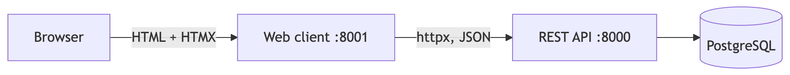
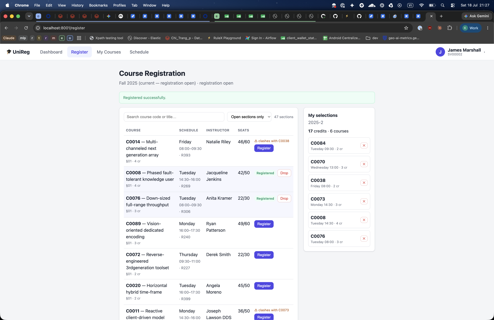
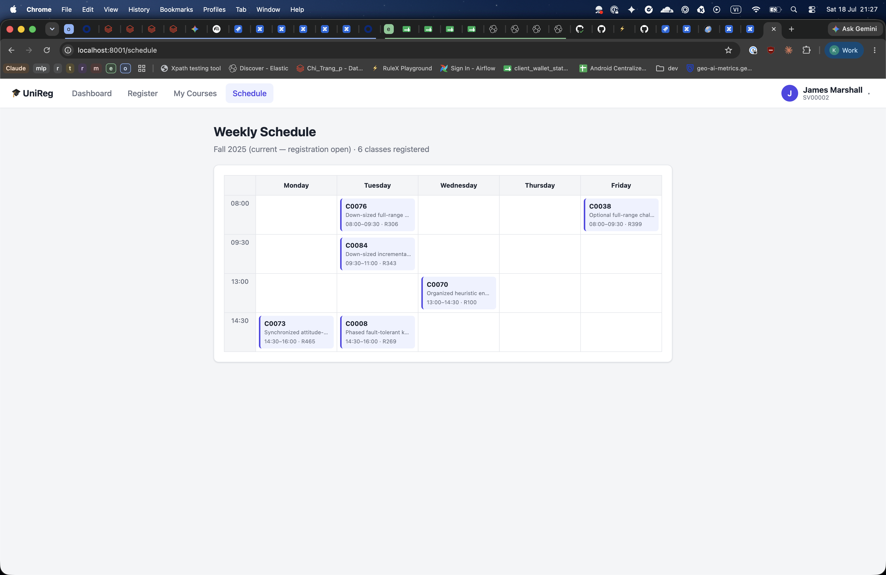

## Bài tập 3

Bài tập 3 là một ứng dụng web dùng các endpoint của API ở Bài tập 2, cho phép
student duyệt offering, đăng ký, hủy, và xem kết quả học tập cùng thời khóa biểu.

### Kiến trúc

Web client (`src/web/`) là một service FastAPI riêng, render HTML bằng Jinja2 +
HTMX và gọi API qua HTTP (`httpx`). Đây là mô hình Backend-for-Frontend: web
client không truy cập database, chỉ tiêu thụ REST API, giữ đúng ranh giới
client/server (phù hợp môn phân tán) và không làm thay đổi JSON API.

HTMX được chọn vì use case chủ yếu là CRUD trên REST: các thao tác search, phân
trang, đăng ký, hủy chỉ cần swap một mảnh HTML (`hx-get`, `hx-post`) thay vì tải
lại trang, nên gần như không phải viết JavaScript và không cần bước build
frontend.

Đăng nhập được giả lập (auth ngoài phạm vi): student hiện tại lưu trong cookie và
được chọn qua profile switcher (góc trên phải, có tìm kiếm). Đây là cách mô phỏng
"ai đang đăng nhập"; hệ thống thật sẽ lấy student từ phiên đã xác thực.

### Các màn hình

- **Dashboard** (`/`): hồ sơ student và các chỉ số suy diễn: GPA tích lũy (trung
  bình có trọng số theo tín chỉ, thang 0 tới 10), số credits đã đạt và đang học,
  trạng thái registration window (còn mở hay đã đóng, còn mấy ngày), và danh sách
  đăng ký hiện tại.
- **Register** (`/register`): duyệt offering của học kỳ đang mở. Search theo
  code/title và phân trang đều làm phía server (dùng luôn `search`, `page` của
  API). Bên cạnh là khu "my selections" liệt kê các môn đã chọn kèm tổng tín chỉ.
  Nút đăng ký/hủy dùng HTMX, sau mỗi thao tác chỉ render lại vùng liên quan nên
  seat, tổng tín chỉ và trạng thái nút cập nhật ngay. Mỗi lần bấm đăng ký, web
  client sinh một `Idempotency-Key` mới nên bấm nhiều lần không tạo trùng.
- **My Courses** (`/transcript`): các môn đã học nhóm theo học kỳ kèm `grade`,
  GPA từng kỳ và GPA tích lũy; có bộ lọc theo học kỳ.
- **Schedule** (`/schedule`): thời khóa biểu dạng lưới (các ngày trong tuần và
  khung giờ) của học kỳ hiện tại.

Chi tiết đáng chú ý:

- **GPA** tính theo trọng số tín chỉ: `GPA = tổng(credits_i * grade_i) /
  tổng(credits_i)` trên các môn COMPLETED, tính ở tầng web (`src/web/academics.py`).
- **Cảnh báo trùng lịch** ở màn hình Register lặp lại đúng luật của server để báo
  trước cho người dùng; server vẫn là nơi quyết định cuối cùng (trả 409 nếu
  thực sự trùng).

### Luồng dữ liệu

Mỗi màn hình map tới một hoặc vài API call. Ví dụ:

- Dashboard: `GET /students/{id}`, `GET /terms`, `GET /students/{id}/enrollments`.
- Register: `GET /offerings` (theo học kỳ mở, có search + page) và
  `GET /students/{id}/enrollments?status=REGISTERED`; đăng ký gọi
  `POST /enrollments`, hủy gọi `DELETE /enrollments/{id}`, sau đó render lại vùng
  danh sách.
- My Courses: `GET /students/{id}/enrollments`.
- Schedule: `GET /students/{id}/schedule?term_id=`.

Lỗi từ API (ví dụ 409 khi trùng lịch hay hết chỗ) được đọc từ body problem+json
và hiển thị thành thông báo ngay trên trang.
