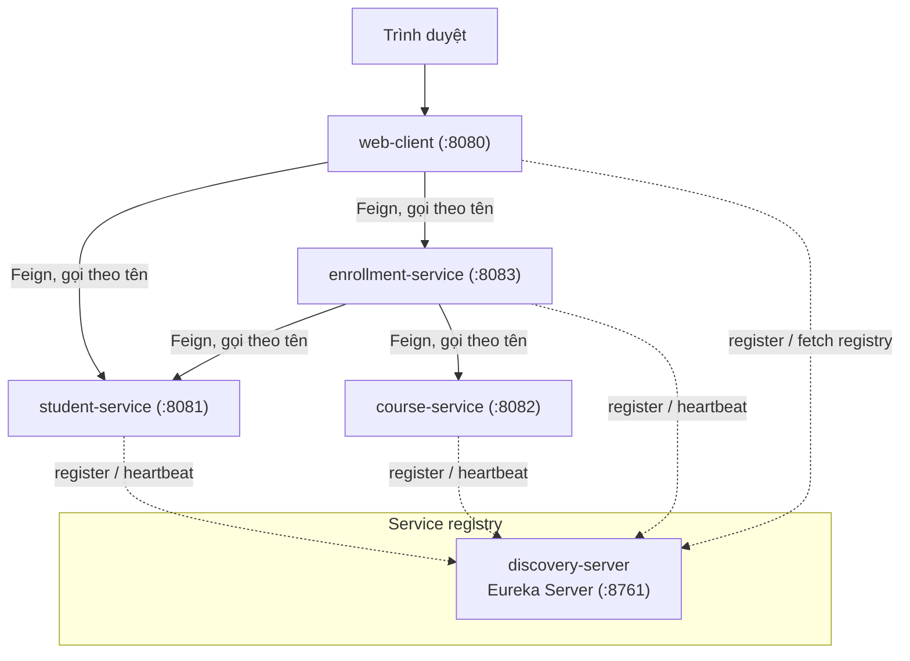
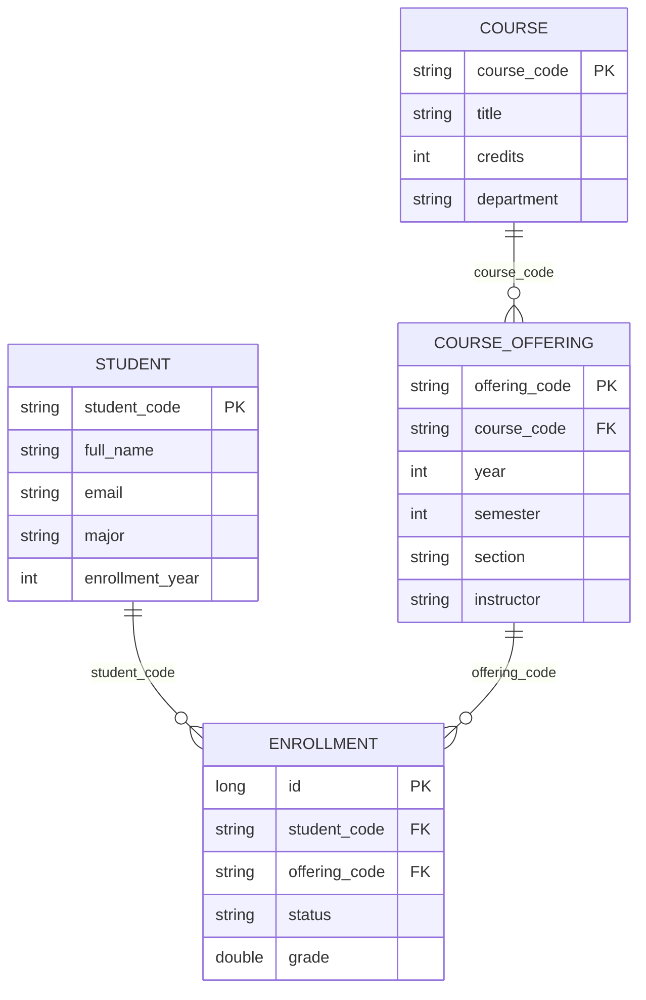

# Kiến trúc tổng thể

Hệ thống quản lý đăng ký học phần được xây dựng theo kiến trúc microservice, gồm
một Discovery Server (Eureka Server) và bốn service độc lập. Mỗi service chạy
riêng, có cơ sở dữ liệu riêng, đăng ký với Eureka Server và gọi nhau thông qua
tên service (service name) chứ không dùng địa chỉ URL cố định.

## Các thành phần

- **discovery-server** (port 8761, không dùng cơ sở dữ liệu): Eureka Server, nơi
  các service đăng ký và khám phá lẫn nhau.
- **student-service** (port 8081, H2 riêng): quản lý thông tin sinh viên.
- **course-service** (port 8082, H2 riêng): quản lý danh sách học phần và các lớp
  học phần (course offering) được mở theo năm / học kỳ / lớp.
- **enrollment-service** (port 8083, H2 riêng): quản lý đăng ký học phần (mỗi bản
  ghi trỏ tới một lớp học phần); tổng hợp bảng điểm và tính GPA bằng cách gọi
  student-service và course-service.
- **web-client** (port 8080, không dùng cơ sở dữ liệu): giao diện web (Thymeleaf)
  hiển thị kết quả.

## Sơ đồ kiến trúc

Đường nét liền là lời gọi HTTP giữa các service (qua OpenFeign). Đường nét đứt là
tương tác với Eureka Server (đăng ký, gửi heartbeat, và lấy danh sách service).

## Mô hình dữ liệu

- **Student** (student-service): `student_code`, họ tên, email, ngành, khóa.
- **Course** (course-service): `course_code`, tên, số tín chỉ, khoa, mô tả.
- **CourseOffering** (course-service): một Course được mở trong một năm + học kỳ
  + lớp, kèm giảng viên. Khóa nghiệp vụ `offering_code` có dạng
  `{course_code}-{năm}-{học kỳ}-{lớp}` (ví dụ `CS101-2025-1-01`).
- **Enrollment** (enrollment-service): liên kết `student_code` với một
  `offering_code`, kèm trạng thái (REGISTERED / COMPLETED / DROPPED) và điểm.

Các quan hệ ở trên là quan hệ logic theo business key: student-service,
course-service và enrollment-service nằm ở ba database riêng, không có foreign key
vật lý xuyên service. Nhờ tham chiếu tới offering, mỗi lượt đăng ký gắn với một
năm và học kỳ cụ thể; GPA được tính theo trung bình có trọng số tín chỉ (thang
điểm 10) trên các học phần đã COMPLETED.

## Nguyên tắc thiết kế

- **Mỗi service sở hữu dữ liệu của riêng mình (no shared database).** Không có
  bảng dùng chung, không có truy vấn join xuyên service. Đây là ranh giới khiến
  các thành phần trở thành service thực sự thay vì các module trong một ứng dụng.
- **Tham chiếu bằng business key.** enrollment-service chỉ lưu `studentCode` và
  `offeringCode` trong mỗi bản ghi đăng ký, không lưu bản sao họ tên hay tên học
  phần. Khi cần hiển thị chi tiết, nó gọi student-service và course-service để
  lấy dữ liệu tại thời điểm đọc.
- **Hợp đồng (contract) tách rời.** Mỗi service tự định nghĩa DTO của mình; bên
  gọi (consumer) chỉ khai báo các trường nó cần. Không dùng thư viện DTO chung để
  tránh ràng buộc chặt giữa các service ở mức biên dịch.
- **web-client không có cơ sở dữ liệu.** Nó chỉ đọc dữ liệu từ các service khác
  qua Feign và kết xuất HTML.

## Công nghệ sử dụng

- Java 17, Spring Boot 4.1.0, Spring Cloud 2025.1.2 (Oakwood).
- Spring Cloud Netflix Eureka cho service discovery.
- Spring Cloud OpenFeign cho lời gọi giữa các service.
- Resilience4j (circuit breaker + fallback) cho xử lý lỗi.
- H2 in-memory cho lưu trữ của từng service; Thymeleaf cho giao diện web.
