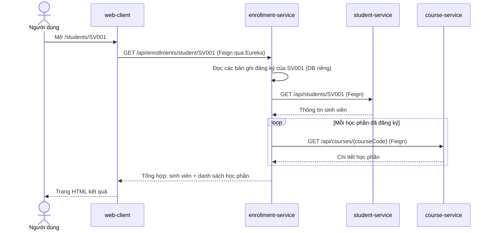
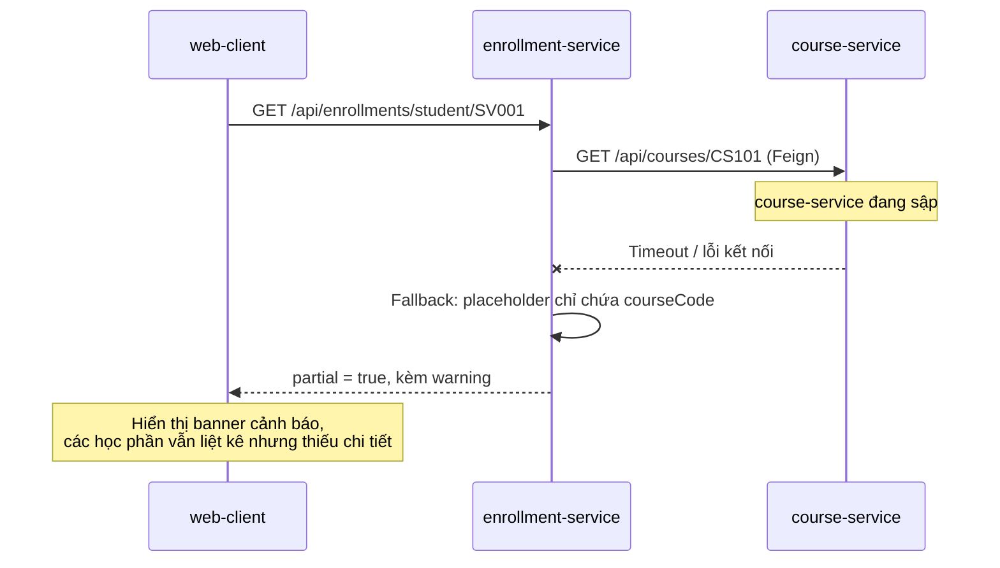

# Luồng xử lý khi xem thông tin đăng ký học phần

Phần này mô tả luồng xử lý khi người dùng xem thông tin đăng ký học phần của một
sinh viên, tức là chức năng tổng hợp chính của hệ thống.

## Các bước xử lý

1. Người dùng mở web-client và chọn một sinh viên trong danh sách (trang
   `/students/{studentCode}`).
2. web-client gọi enrollment-service qua Feign:
   `GET /api/enrollments/student/{studentCode}`. Tên `enrollment-service` được
   phân giải thành một instance cụ thể nhờ Eureka Server.
3. enrollment-service đọc các bản ghi đăng ký của sinh viên từ cơ sở dữ liệu
   riêng của nó (chỉ chứa `studentCode`, `courseCode`, trạng thái, điểm).
4. Để bổ sung chi tiết, enrollment-service gọi tiếp:
   - student-service: `GET /api/students/{studentCode}` để lấy thông tin sinh
     viên (họ tên, email, ngành, khóa).
   - course-service: `GET /api/courses/{courseCode}` cho từng học phần để lấy
     tên học phần, số tín chỉ, khoa.
5. enrollment-service tổng hợp tất cả thành một response duy nhất và trả về cho
   web-client.
6. web-client kết xuất trang HTML: thông tin sinh viên cùng bảng các học phần đã
   đăng ký.

## Sơ đồ tuần tự (luồng thành công)

## Luồng khi một service không sẵn sàng (suy giảm mềm)

Nếu course-service (hoặc student-service) tạm thời không phản hồi, lời gọi Feign
tương ứng thất bại và circuit breaker kích hoạt fallback. enrollment-service vẫn
trả về response, nhưng đánh dấu `partial = true` và kèm cảnh báo.

Điểm quan trọng: dữ liệu đăng ký (mã học phần, trạng thái, điểm) luôn có vì thuộc
cơ sở dữ liệu riêng của enrollment-service; chỉ phần chi tiết lấy từ service khác
mới bị thiếu. Hệ thống suy giảm mềm thay vì trả về lỗi toàn bộ.
