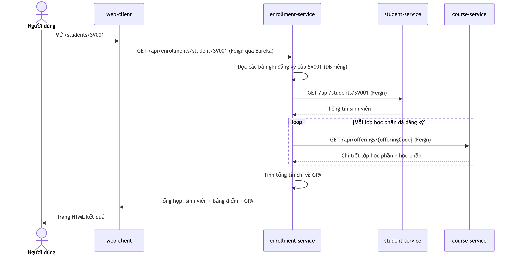
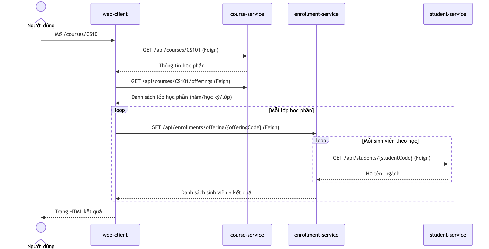
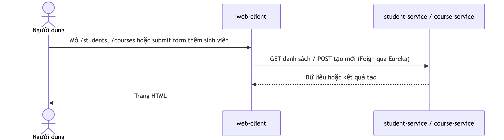
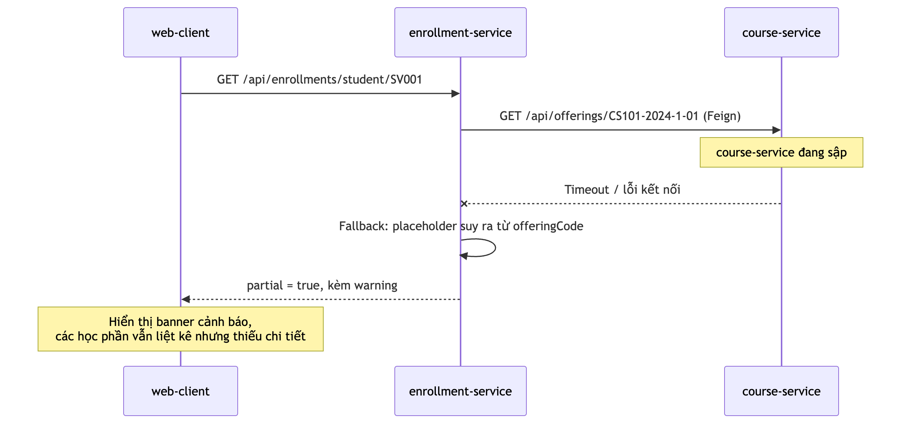

# Luồng xử lý

Phần này mô tả các luồng xử lý của hệ thống: hai luồng tổng hợp cross-service
(xem bảng điểm của một sinh viên, và xem chi tiết một học phần cùng danh sách sinh
viên theo học), và các luồng đơn giản chỉ chạm một service.

## Luồng 1: xem thông tin đăng ký học phần của một sinh viên

1. Người dùng mở web-client và chọn một sinh viên (trang
   `/students/{studentCode}`).
2. web-client gọi enrollment-service qua Feign:
   `GET /api/enrollments/student/{studentCode}`. Tên `enrollment-service` được
   phân giải thành một instance cụ thể nhờ Eureka Server.
3. enrollment-service đọc các bản ghi đăng ký của sinh viên từ cơ sở dữ liệu
   riêng của nó (chỉ chứa `studentCode`, `offeringCode`, trạng thái, điểm).
4. Để bổ sung chi tiết, enrollment-service gọi tiếp:
   - student-service: `GET /api/students/{studentCode}` để lấy thông tin sinh
     viên (họ tên, email, ngành, khóa).
   - course-service: `GET /api/offerings/{offeringCode}` cho từng lớp học phần để
     lấy tên học phần, số tín chỉ, khoa, năm và học kỳ.
5. enrollment-service tính các chỉ số học tập: tổng số học phần, số tín chỉ tích
   lũy (COMPLETED), số tín chỉ đang học (REGISTERED), và GPA (trung bình có trọng
   số tín chỉ trên thang điểm 10).
6. enrollment-service tổng hợp tất cả thành một response duy nhất và trả về cho
   web-client.
7. web-client kết xuất trang HTML: thông tin sinh viên, các chỉ số học tập, và
   bảng học phần (đã hoàn thành / đang đăng ký).

## Luồng 2: xem chi tiết một học phần

1. Người dùng mở trang `/courses/{courseCode}` trên web-client.
2. web-client gọi course-service: `GET /api/courses/{courseCode}` (thông tin học
   phần) và `GET /api/courses/{courseCode}/offerings` (các lớp đã mở theo
   năm / học kỳ / lớp).
3. Với mỗi lớp học phần, web-client gọi enrollment-service:
   `GET /api/enrollments/offering/{offeringCode}` để lấy danh sách sinh viên theo
   học cùng trạng thái và điểm.
4. enrollment-service, để hiển thị tên sinh viên, gọi tiếp student-service
   (`GET /api/students/{studentCode}`) cho mỗi sinh viên.
5. web-client kết xuất: thông tin học phần, các lớp đã mở, và với mỗi lớp là danh
   sách sinh viên kèm kết quả.

## Các luồng một service (không cross-service)

Các thao tác còn lại chỉ chạm đúng một service, không cần bước tổng hợp:

- **Xem danh sách** (`/students`, `/courses`): web-client gọi một service duy nhất
  (student-service hoặc course-service) bằng Feign rồi kết xuất bảng.
- **Thêm sinh viên** (`/students/new`): web-client gửi form tới student-service
  (`POST /api/students`); thành công thì chuyển hướng sang trang chi tiết sinh
  viên, trùng mã hoặc email thì hiển thị lỗi ngay trên form.

Điểm chung: vẫn gọi service theo tên qua Eureka + Feign, chỉ khác là không tổng
hợp dữ liệu từ nhiều service.

## Luồng khi một service không sẵn sàng (graceful degradation)

Nếu course-service (hoặc student-service) tạm thời không phản hồi, lời gọi Feign
tương ứng thất bại và circuit breaker kích hoạt fallback. enrollment-service vẫn
trả về response, nhưng đánh dấu `partial = true` và kèm cảnh báo.

Điểm quan trọng: dữ liệu đăng ký (mã lớp học phần, trạng thái, điểm) luôn có vì
thuộc cơ sở dữ liệu riêng của enrollment-service; chỉ phần chi tiết lấy từ service
khác mới bị thiếu. Hệ thống degrade thay vì trả về lỗi toàn bộ. Riêng lỗi 404
thật (sinh viên không tồn tại) vẫn được trả về đúng là 404, phân biệt với trường
hợp service tạm thời không sẵn sàng.
