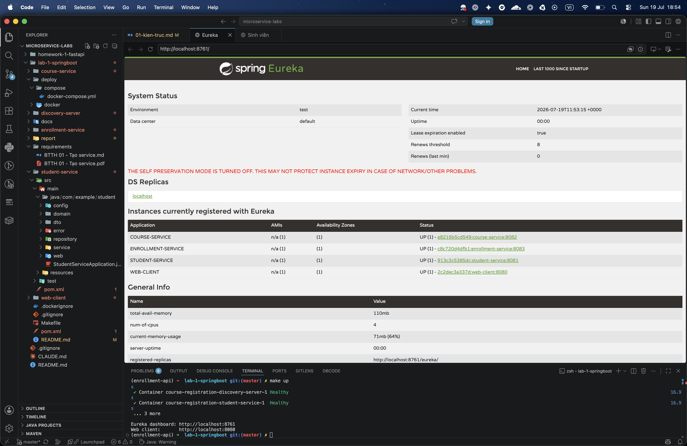
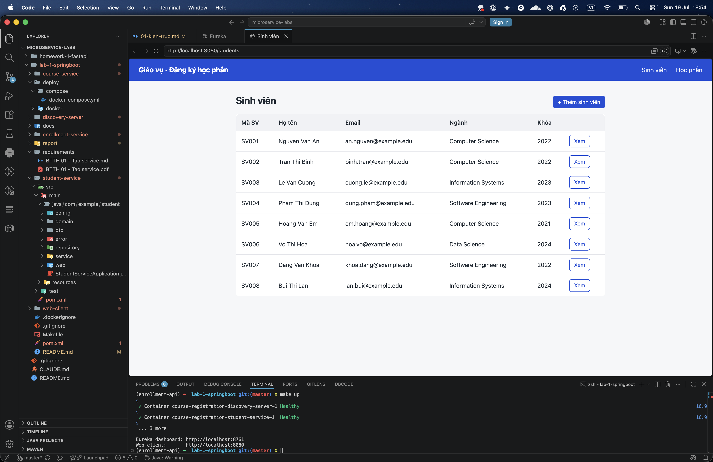
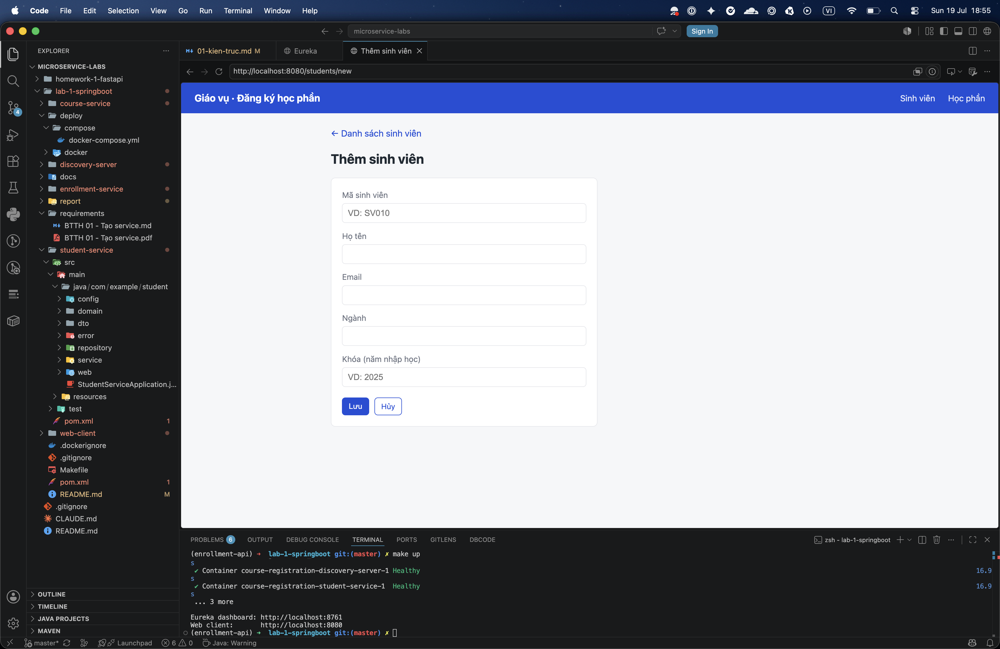
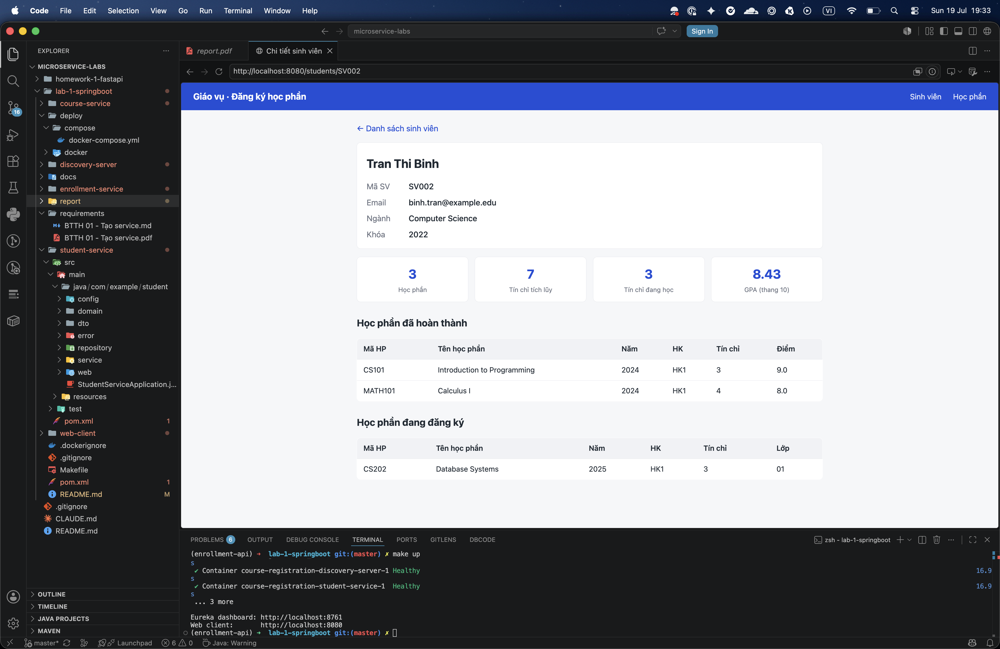
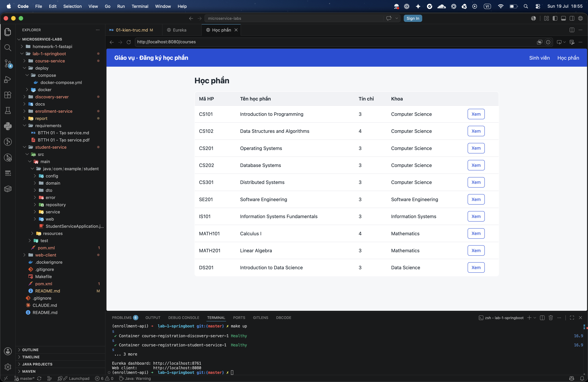
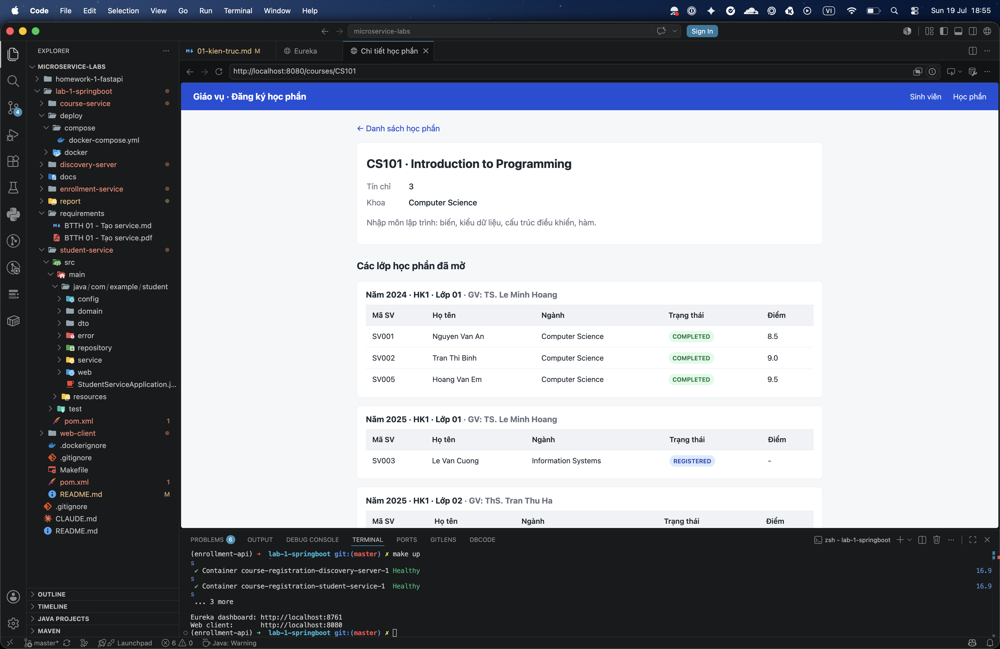

# Tổ chức mã nguồn và minh chứng kết quả

## Tổ chức mã nguồn

Dự án dùng Maven multi-module: một parent POM quản lý phiên bản (Spring Boot
parent và Spring Cloud BOM) và năm module con, mỗi module là một service có thể
chạy độc lập.

```
lab-1-springboot/
  pom.xml                  parent POM (Java 17, Spring Cloud BOM)
  discovery-server/        Eureka Server
  student-service/         sinh viên (web + JPA + H2 + Eureka client)
  course-service/          học phần (web + JPA + H2 + Eureka client)
  enrollment-service/      đăng ký + Feign + Resilience4j (tổng hợp)
  web-client/              giao diện Thymeleaf (Feign, không có DB)
  deploy/docker/           Dockerfile multi-stage (import CA vào JVM truststore)
  deploy/compose/          docker-compose.yml (5 service, gated theo Eureka)
  docs/design_notes.md     lý giải thiết kế và các đánh đổi
  Makefile
```

Trong mỗi service, mã nguồn được chia lớp rõ ràng: `domain` (entity), `repository`
(truy cập dữ liệu), `dto` (hợp đồng JSON), `service` (nghiệp vụ), `web`
(controller REST hoặc controller Thymeleaf), `client` (Feign client, ở
enrollment-service và web-client), và `error` (xử lý lỗi trả về RFC 7807
ProblemDetail).

## Cách chạy

```bash
make up      # build và khởi động toàn bộ hệ thống
make ps      # theo dõi các container chuyển sang trạng thái healthy
```

- Eureka dashboard: http://localhost:8761
- Web client: http://localhost:8080

## Minh chứng

### Eureka Dashboard hiển thị các service đã đăng ký

Ảnh chụp trang http://localhost:8761 cho thấy bốn service (STUDENT-SERVICE,
COURSE-SERVICE, ENROLLMENT-SERVICE, WEB-CLIENT) đã đăng ký trong mục "Instances
currently registered with Eureka".



### Web Client (giao diện giáo vụ)

Web Client đóng vai trò console cho giáo vụ. Mỗi màn hình kèm một ảnh minh chứng:











### Minh chứng graceful degradation (tùy chọn)

Khi dừng course-service rồi tải lại trang, các học phần vẫn được liệt kê nhưng
phần chi tiết được đánh dấu là không có, kèm banner cảnh báo. Điều này minh họa
cơ chế fallback của Resilience4j.

<!-- TODO: chèn ảnh assets/web-degraded.png nếu muốn minh họa luồng graceful degradation. -->

## Tự đánh giá theo thang điểm

- **Hoàn thành Discovery Server và các service (2.0 điểm):** Eureka Server và bốn
  service chạy độc lập, đăng ký với Eureka.
- **Xây dựng đầy đủ các chức năng yêu cầu (3.0 điểm):** student-service (xem danh
  sách, xem chi tiết, thêm mới); course-service (xem danh sách, xem chi tiết, các
  lớp học phần theo năm/học kỳ); enrollment-service (bảng điểm + GPA của sinh
  viên và danh sách sinh viên theo học một lớp, tổng hợp qua service khác);
  web-client (giao diện giáo vụ hiển thị đầy đủ).
- **Giao tiếp đúng qua Eureka/OpenFeign (2.0 điểm):** gọi theo tên service qua
  OpenFeign, kèm timeout và fallback.
- **Báo cáo rõ kiến trúc và luồng xử lý (2.0 điểm):** sơ đồ kiến trúc, vai trò
  Eureka, lợi ích gọi theo tên, sơ đồ tuần tự luồng xử lý.
- **Trình bày, tổ chức mã nguồn và minh chứng (1.0 điểm):** chia lớp rõ ràng,
  README, docs/design_notes, ảnh minh chứng.
